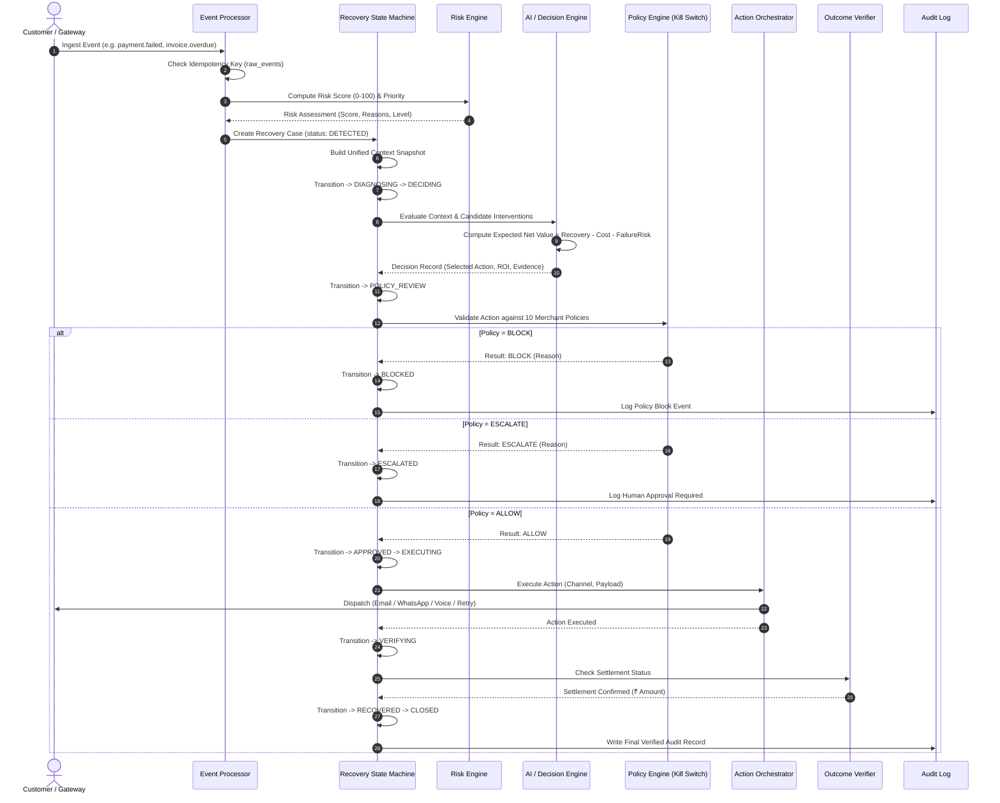

# RecoveroAI — Autonomous Revenue Recovery Platform
## System Architecture, File Structure, Data Flow & Technical Specification

---

## 1. Executive Summary & Core Vision

**RecoveroAI** is an autonomous revenue recovery engine built for high-growth commerce, SaaS subscriptions, and B2B enterprises.

### Core Promise
> **Detect revenue at risk → Diagnose root cause → Decide optimal intervention → Validate with deterministic policies → Execute action → Verify financial settlement → Audit every step.**

RecoveroAI orchestrates seven distinct revenue recovery workflows under **one common state machine and decision pipeline**:
1. **Payment Failure Recovery** (Transient declines, 3DS timeouts, insufficient funds)
2. **Checkout Drop-off Recovery** (High-intent cart abandonment, checkout dropouts)
3. **Failed-Subscription Recovery** (Involuntary churn, expired credit/debit cards)
4. **B2B Receivables Chaser** (Aging corporate invoices, customized multi-touch cadences)
5. **Mandate Retry Sequencer** (e-Mandates, NACH, UPI AutoPay recurring debit cooling schedules)
6. **Hinglish Voice Recovery** (Empathetic colloquial voice agent with real-time intent parsing)
7. **Promise-to-Pay Tracker** (Commitment ledger with automated due-date reminders & verification)

### 1.1 The Canonical Merchant Recovery Lifecycle

```
Merchant logs into RecoveroAI
            ↓
Overview sees ₹ revenue at risk
            ↓
Simulation / Payment events enter system
            ↓
RecoveroAI creates Recovery Cases
            ↓
AI (Google Gemini API) analyzes each case
            ↓
Recommends best recovery action
            ↓
Merchant approves (or automation executes within policy)
            ↓
Retry / WhatsApp / Email / Voice Call dispatched
            ↓
Customer responds or pays
            ↓
Payment verified by Gateway
            ↓
Money marked as RECOVERED
            ↓
Analytics updated in real time
            ↓
Every action stored in immutable Audit Trail
```

#### How Each Step Operates:
1. **Merchant Login & Overview**: When the merchant opens the Command Center (`/dashboard`), the aggregate KPI cards instantly display real-time **₹ Revenue at Risk**, **₹ Potentially Recoverable**, **₹ Revenue Recovered**, and **Recovery Rate (%)**, with live recovery cases and audit logs.
2. **Event Ingestion**: Live payment webhooks or simulated batches hit `/api/events` or `/api/demo/generate`. The Idempotency Layer deduplicates events against `raw_events`.
3. **Case Creation & Context Snapshotting**: The Risk Engine computes a 0–100 deterministic risk score and initializes a `recovery_cases` record in `status: DETECTED`. A frozen snapshot of customer history, invoice/mandate/payment data, and prior attempts is saved to `case_context`.
4. **AI Analysis (Google Gemini API)**: When the case enters `DIAGNOSING -> DECIDING`, the system invokes `runRecoveryAgent()` via Google's official `@google/genai` SDK (`gemini-2.5-flash`), providing rich structured context across amounts, past successes, and channel permissions. Gemini diagnoses the root cause and outputs a strictly typed JSON payload containing candidate interventions and expected ROI.
5. **Policy Gatekeeping (Kill Switch)**: Every recommended action must pass 10 deterministic merchant guardrails (max retries, high-value ceiling, consent, voice calling hours 10AM–7PM IST, B2B reminder limits, and cooling intervals). Violations transition the case to `BLOCKED` or `ESCALATED`.
6. **Merchant Approval & Execution**: If policy allows and the transaction requires review, the merchant clicks **"Approve & Execute Action"** in the UI. If pre-authorized, the Action Orchestrator dispatches the action through pluggable adapters (Email, WhatsApp, Gateway Retry, Hinglish Voice Call).
7. **Settlement Verification & Recovery**: The Outcome Verifier independently verifies settlement with the gateway/bank or payment proof. Upon confirmation, the case transitions to `RECOVERED`, underlying payment/invoice status updates to `succeeded` / `paid`, and verified revenue is recorded.
8. **Real-time Analytics & Audit Trail**: The Overview dashboard immediately updates recovered revenue figures, and every single step, state change, and policy check is immutably logged to `audit_logs`.

---

## 2. High-Level System Architecture

```
                                  INCOMING REVENUE EVENTS
                 (Webhooks: Stripe, Razorpay, NACH, Invoices, Voice Sessions)
                                             │
                                             ▼
                                  ┌─────────────────────┐
                                  │   Raw Event Store   │ (Idempotency Check)
                                  └──────────┬──────────┘
                                             │
                                             ▼
                                  ┌─────────────────────┐
                                  │    Risk Engine      │ (Deterministic 0-100 Score)
                                  └──────────┬──────────┘
                                             │
                                             ▼
                                  ┌─────────────────────┐
                                  │   Recovery Case     │ (Unified 12-State Machine)
                                  │ & Context Snapshot  │
                                  └──────────┬──────────┘
                                             │
                                             ▼
                 ┌───────────────────────────────────────────────────────┐
                 │                   DECISION ENGINE                     │
                 │   - Gemini AI Agent (Multi-factor reasoning)          │
                 │   - Deterministic Heuristic Engine (High-Scale Sim)   │
                 │   - Cost & Economic ROI Optimizer (Net Value Max)     │
                 └───────────────────────────┬───────────────────────────┘
                                             │ Candidate Action Recommendation
                                             ▼
                 ┌───────────────────────────────────────────────────────┐
                 │               POLICY VALIDATION ENGINE                │
                 │          (10 Hard Deterministic Guardrails)           │
                 │  - Max Retries Limit      - High-Value Dollar Cap     │
                 │  - Customer Contact Consent - Duplicate Protection   │
                 │  - Cost Ceiling Ratio     - Voice Calling Hours       │
                 │  - B2B Reminder Frequency - Mandate Cooling Intervals │
                 └──────────────┬────────────────────────┬───────────────┘
                                │ ALLOW                  │ BLOCK / ESCALATE
                                ▼                        ▼
                 ┌─────────────────────┐  ┌──────────────────────────────┐
                 │ Action Orchestrator │  │ Human Escalation / Freeze    │
                 └──────────┬──────────┘  └──────────────────────────────┘
                            │ Dispatches to Adapters
                            ▼
        ┌──────────────────────────────────────────────────┐
        │                 PROVIDER ADAPTERS                │
        │  ├── Communication Adapter (Email, WhatsApp, SMS)│
        │  ├── Voice Adapter (Hinglish Conversational IVR) │
        │  └── Payment Adapter (Gateway Re-authorization)  │
        └───────────────────┬──────────────────────────────┘
                            │
                            ▼
                 ┌─────────────────────┐
                 │  Outcome Verifier   │ (Independent Proof of Settlement)
                 └──────────┬──────────┘
                            │
                            ▼
                 ┌─────────────────────┐
                 │ Immutable Audit Log │ (Complete Operational Trace)
                 └─────────────────────┘
```

---

## 3. End-to-End Data Flow



---

## 4. Complete File Structure & Codebase Map

```
c:/SaaS/recovero/
├── app/                                 # Next.js 16 App Router UI & API Routes
│   ├── (dashboard)/                     # Protected Merchant Dashboard Shell
│   │   ├── layout.tsx                   # Sidebar navigation, demo actions, navbar
│   │   ├── dashboard/page.tsx           # Command Center overview, KPIs, recovery funnel
│   │   ├── recoveries/page.tsx          # Master recovery cases directory with filters
│   │   ├── recoveries/[id]/page.tsx     # Case detail view (7-stage timeline, AI, policy, audit)
│   │   ├── b2b/page.tsx                 # B2B Receivables Chaser (aging buckets, reminders)
│   │   ├── mandates/page.tsx            # Mandate Retry Sequencer (multi-attempt cooling steps)
│   │   ├── voice/page.tsx               # Hinglish Voice Recovery (live interactive transcripts)
│   │   ├── promises/page.tsx            # Promise-to-Pay Tracker (commitments ledger)
│   │   ├── payments/page.tsx            # Payment transactions list & retry status
│   │   ├── subscriptions/page.tsx       # Recurring subscriptions & churn prevention
│   │   ├── customers/page.tsx           # Customer directory with risk scores & LTV
│   │   ├── analytics/page.tsx           # Financial analytics & ROI breakdowns
│   │   ├── audit/page.tsx               # Immutable audit trail search & inspector
│   │   ├── simulation/page.tsx          # High-performance batch simulation engine
│   │   └── settings/page.tsx            # Merchant policy rules & risk threshold controls
│   │
│   ├── api/                             # Backend REST & Action Endpoints
│   │   ├── analytics/route.ts           # Overview KPIs and financial metrics
│   │   ├── audit/route.ts               # Audit logs retrieval with query filtering
│   │   ├── customers/route.ts           # Customer profile management
│   │   ├── demo/
│   │   │   ├── generate/route.ts        # Synthetic dataset demo seeder
│   │   │   ├── trigger-payment-failure/ # Instant payment failure case creation
│   │   │   └── trigger-policy-violation/# Instant Kill Switch demonstration trigger
│   │   ├── events/route.ts              # Webhook ingestion endpoint
│   │   ├── invoices/                    # B2B invoice APIs (list, remind, promise, escalate)
│   │   ├── mandates/                    # Mandate sequencer APIs (list, retry, verify)
│   │   ├── payments/route.ts            # Payment ledger query API
│   │   ├── promises/                    # Promise-to-Pay APIs (list, remind, verify)
│   │   ├── recoveries/                  # Case listing, detail, run-agent, execute, verify
│   │   ├── simulation/route.ts          # Batch simulation runner vs baseline
│   │   ├── subscriptions/route.ts       # Subscriptions query API
│   │   └── voice/sessions/              # Voice session initialization and intent parsing
│   │
│   ├── globals.css                      # Tailwind CSS v4 & custom light-theme variables
│   ├── layout.tsx                       # Root layout with Geist fonts & metadata
│   └── page.tsx                         # High-converting landing page showcasing 7 workflows
│
├── src/
│   ├── components/                      # Reusable Modular UI Components
│   │   ├── audit/                       # AuditTimeline, EventBadge
│   │   ├── dashboard/                   # MetricCard, RecoveryFunnel, ActivityFeed
│   │   ├── recovery/                    # DecisionCard, EvidenceList, PolicyCheckList, RecoveryTimeline
│   │   ├── shared/                      # PageHeader, RiskBadge, StatusBadge, EmptyState
│   │   └── simulation/                  # BaselineComparisonCard, SimulationSummaryCard
│   │
│   ├── db/                              # Persistence Layer (PostgreSQL & Drizzle ORM)
│   │   ├── index.ts                     # Database connection pool initialization
│   │   └── schema.ts                    # 17 tables & relations (Merchants, Invoices, Mandates, Voice, Promises, Cases)
│   │
│   ├── lib/                             # Core Domain Engines & Business Logic
│   │   ├── agent/
│   │   │   ├── agent.ts                 # Google Gemini AI reasoning agent
│   │   │   └── deterministic-agent.ts   # Deterministic decision engine for high-scale simulation
│   │   │
│   │   ├── audit/
│   │   │   └── index.ts                 # Structured audit logger with metadata persistence
│   │   │
│   │   ├── cost/
│   │   │   └── cost-engine.ts           # Economic ROI & net recovery value calculation engine
│   │   │
│   │   ├── events/
│   │   │   └── event-processor.ts       # Idempotent event ingestion & case bootstrapping
│   │   │
│   │   ├── policy/
│   │   │   └── policy-engine.ts         # Deterministic 10-rule policy validator & Kill Switch
│   │   │
│   │   ├── providers/                   # Extensible Provider Adapters
│   │   │   ├── communication-provider.ts# Email, WhatsApp, SMS messaging adapter
│   │   │   ├── payment-provider.ts      # Gateway re-authorization adapter
│   │   │   └── voice-provider.ts        # Hinglish speech & intent classification adapter
│   │   │
│   │   ├── recovery/
│   │   │   ├── action-orchestrator.ts   # Multi-channel execution dispatcher
│   │   │   ├── decision-executor.ts     # Decoupled AI-to-Policy-to-Execution bridge
│   │   │   ├── outcome-verifier.ts      # Independent financial proof verification
│   │   │   └── recovery-engine.ts       # 12-state recovery state machine & context builder
│   │   │
│   │   ├── risk/
│   │   │   └── risk-engine.ts           # Deterministic 0-100 explainable risk scoring
│   │   │
│   │   ├── simulation/
│   │   │   ├── baseline-engine.ts       # Rule-of-thumb baseline strategy simulator
│   │   │   └── simulation-engine.ts     # Batch simulation engine with comparative metrics
│   │   │
│   │   ├── workflows/                   # Specialized Workflow Implementations
│   │   │   ├── b2b-receivables-workflow.ts
│   │   │   ├── mandate-retry-workflow.ts
│   │   │   ├── promise-to-pay-workflow.ts
│   │   │   ├── voice-recovery-workflow.ts
│   │   │   └── workflow-registry.ts     # Unified workflow registry contract
│   │   │
│   │   └── __tests__/                   # Vitest Unit Test Suites (100% Passing)
│   │       ├── b2b-workflow.test.ts
│   │       ├── cost-engine.test.ts
│   │       ├── mandate-workflow.test.ts
│   │       ├── policy-engine.test.ts
│   │       ├── promise-workflow.test.ts
│   │       ├── risk-engine.test.ts
│   │       ├── state-machine.test.ts
│   │       └── voice-workflow.test.ts
│   │
│   └── types/
│       └── recovery.ts                  # TypeScript types, enums, interfaces, and contracts
│
├── scripts/
│   ├── generate-dataset.ts              # Realistic synthetic data generator for 7 workflows
│   └── seed.ts                          # Database seeder with merchant & customer cases
│
├── drizzle.config.ts                    # Drizzle ORM configuration
├── package.json                         # Project dependencies & scripts
├── tsconfig.json                        # TypeScript strict configuration
└── vitest.config.ts                     # Vitest test runner configuration
```

---

## 5. Database Schema & Data Models

The persistence layer uses **PostgreSQL** with **Drizzle ORM** across 17 relational tables:

| Table Name | Description | Key Columns / Relations |
|---|---|---|
| `merchants` | First-class tenant root | `id`, `name`, `email`, `policyJson` |
| `customers` | Customer profiles & risk ledger | `id`, `merchantId`, `externalId`, `name`, `lifetimeValue`, `contactPermission`, `riskScore` |
| `payments` | Transactions ledger | `id`, `merchantId`, `customerId`, `amount`, `status`, `failureReason`, `retryCount` |
| `subscriptions` | Recurring recurring billing plans | `id`, `customerId`, `planName`, `amount`, `status`, `nextBillingAt` |
| `invoices` | B2B enterprise invoices | `id`, `customerId`, `invoiceNumber`, `amount`, `status`, `daysOverdue`, `accountOwner` |
| `invoice_communications` | Multi-touch reminder log | `id`, `invoiceId`, `channel`, `messageType`, `sentAt`, `result` |
| `mandates` | e-Mandates, NACH, UPI AutoPay | `id`, `customerId`, `mandateReference`, `amount`, `status`, `retryCount`, `maxRetries` |
| `mandate_attempts` | Mandate retry history | `id`, `mandateId`, `attemptNumber`, `scheduledAt`, `status`, `failureReason` |
| `voice_sessions` | Hinglish conversational sessions | `id`, `customerId`, `caseId`, `language`, `transcript`, `detectedIntent`, `status` |
| `promises_to_pay` | Customer commitment records | `id`, `customerId`, `invoiceId`, `caseId`, `promisedAmount`, `promisedDate`, `status` |
| `raw_events` | Idempotent webhook logs | `id`, `eventId`, `eventType`, `source`, `payload`, `receivedAt`, `processedAt` |
| `recovery_cases` | Unified state machine cases | `id`, `merchantId`, `customerId`, `paymentId`, `invoiceId`, `mandateId`, `caseType`, `amountAtRisk`, `riskScore`, `riskLevel`, `status`, `nextActionAt` |
| `case_context` | Frozen diagnostic snapshots | `id`, `caseId`, `customerSnapshot`, `paymentSnapshot`, `invoiceSnapshot`, `mandateSnapshot`, `voiceSnapshot`, `promiseSnapshot` |
| `decision_records` | AI recommendations & ROI | `id`, `caseId`, `candidateActions`, `selectedAction`, `expectedRecovery`, `estimatedCost`, `expectedNetValue`, `expectedRoi`, `confidence`, `evidence` |
| `policy_check_logs` | Audit of 10 policy checks | `id`, `caseId`, `action`, `ruleName`, `result` (ALLOW/BLOCK/ESCALATE), `reason` |
| `action_logs` | Executed interventions | `id`, `caseId`, `actionType`, `channel`, `payload`, `status`, `executedAt`, `result` |
| `outcome_logs` | Financial verification proofs | `id`, `caseId`, `status`, `amountRecovered`, `verified`, `verificationSource` |
| `audit_logs` | Immutable operational trace | `id`, `caseId`, `actor`, `event`, `metadata`, `timestamp` |
| `simulation_runs` | Batch simulation benchmark runs | `id`, `strategy`, `workflowType`, `totalEvents`, `revenueRecovered`, `recoveryRate`, `roi`, `baselineComparison` |

---

## 6. The 12-State Recovery State Machine

```
   [DETECTED]
       │
       ▼
  [DIAGNOSING] ───(Failure)───► [FAILED] ───► [CLOSED]
       │                           ▲
       ▼                           │
   [DECIDING]                      │
       │                           │
       ▼                           │
 [POLICY_REVIEW] ───(Blocked)────► [BLOCKED] ───► [CLOSED]
       │                           │
  (Allowed) ───(Escalate)──► [ESCALATED]
       │                           │
       ▼                           ▼
   [APPROVED] ───────────────► [EXECUTING]
                                   │
                                   ▼
                              [VERIFYING]
                               │       │
                     (Verified)│       │(Unverified)
                               ▼       ▼
                          [RECOVERED] [FAILED]
                               │
                               ▼
                            [CLOSED]
```

### Valid Transition Table
| State | Allowed Next States |
|---|---|
| `DETECTED` | `DIAGNOSING`, `CLOSED` |
| `DIAGNOSING` | `DECIDING`, `FAILED`, `CLOSED` |
| `DECIDING` | `POLICY_REVIEW`, `ESCALATED`, `FAILED` |
| `POLICY_REVIEW` | `APPROVED`, `BLOCKED`, `ESCALATED` |
| `APPROVED` | `EXECUTING`, `BLOCKED` |
| `EXECUTING` | `VERIFYING`, `FAILED` |
| `VERIFYING` | `RECOVERED`, `FAILED`, `EXECUTING`, `ESCALATED` |
| `RECOVERED` | `CLOSED` |
| `FAILED` | `DIAGNOSING`, `ESCALATED`, `CLOSED` |
| `ESCALATED` | `APPROVED`, `EXECUTING`, `CLOSED` |
| `BLOCKED` | `ESCALATED`, `CLOSED` |
| `CLOSED` | *Terminal State* |

---

## 7. Deterministic Policy Rules & Safety Controls

RecoveroAI enforces **10 deterministic guardrails**. AI models cannot bypass these rules.

| Rule ID | Rule Name | Description | Policy Outcome |
|---|---|---|---|
| `RULE_1` | `MAX_RETRIES` | Limits gateway retries to 4 (or merchant configured) to avoid card network penalty fees. | `ESCALATE` |
| `RULE_2` | `HIGH_VALUE` | Transactions above ₹100,000 (or ₹50,000 for B2B) require manual human approval. | `ESCALATE` |
| `RULE_3` | `ALREADY_RECOVERED` | If payment/invoice is already paid, abort immediately. | `BLOCK` |
| `RULE_4` | `CUSTOMER_CONTACT` | Direct outreach (Email, WhatsApp, SMS, Voice) requires valid customer consent. | `BLOCK` |
| `RULE_5` | `DUPLICATE_ACTION` | Prevents the same action from firing multiple times in a single recovery cycle. | `BLOCK` |
| `RULE_6` | `COST_CEILING` | Action cost cannot exceed 15% of expected recovery amount. | `BLOCK` |
| `RULE_7` | `QUIET_HOURS` | Restricts automated SMS/WhatsApp alerts during late night hours (10 PM – 8 AM). | `BLOCK` |
| `RULE_8` | `B2B_REMINDER_LIMIT` | B2B invoices capped at 3 automated reminders before mandatory Account Owner escalation. | `ESCALATE` |
| `RULE_9` | `VOICE_CALLING_HOURS` | Voice calls restricted to 10:00 AM – 7:00 PM IST per telecommunication regulations. | `BLOCK` |
| `RULE_10` | `MANDATE_MIN_INTERVAL` | Mandate retries must respect a minimum 6-hour bank cooling interval. | `BLOCK` |

---

## 8. The 7 Revenue Recovery Workflows

### 1. Payment Failure Recovery
- **Trigger**: `payment.failed` webhook
- **Diagnosis**: Insufficient funds, 3DS timeout, expired card, gateway downtime
- **Action**: Immediate gateway retry, scheduled delayed retry (+6h/+24h), or 1-click update link
- **Verification**: Bank/Gateway authorization confirmation

### 2. Checkout Drop-off Recovery
- **Trigger**: `checkout.abandoned` webhook
- **Diagnosis**: High-intent customer abandoned at final payment step
- **Action**: Interactive WhatsApp message with dynamic pre-filled 1-click checkout link
- **Verification**: Order creation & successful payment settlement

### 3. Failed-Subscription Recovery
- **Trigger**: `subscription.failed` webhook
- **Diagnosis**: Involuntary churn due to card expiration or recurring billing failure
- **Action**: Grace-period email notification with secure card updating portal
- **Verification**: Subscription state returns to `active`

### 4. B2B Receivables Chaser
- **Trigger**: `invoice.overdue`, `invoice.approaching_due`
- **Diagnosis**: Aging enterprise invoice (e.g. 12 days overdue, ₹85,000)
- **Action**: Professional reminder with instant RTGS/UPI link, or escalation to Account Owner
- **Verification**: Invoice status transitions to `paid` with settlement timestamp

### 5. Mandate Retry Sequencer
- **Trigger**: `mandate.failed` (e-Mandate / NACH / UPI AutoPay)
- **Diagnosis**: Transient bank liquidity issue on scheduled recurring debit
- **Action**: 3-attempt sequence with 6h / 24h bank cooling windows + WhatsApp prompt
- **Verification**: Mandate status updated to `recovered` upon successful bank debit

### 6. Hinglish Voice Recovery
- **Trigger**: `voice.intent_detected`, high-value payment failure with phone consent
- **Diagnosis**: Natural colloquial Hindi-English speech conversation
- **Intents**: `PAY_NOW`, `TRY_LATER`, `NEEDS_HELP`, `DECLINE`, `WRONG_NUMBER`, `HUMAN_AGENT`
- **Action**: 
  - If `TRY_LATER` ("Kal karunga"): Automatically creates a Promise-to-Pay record
  - If `PAY_NOW` ("Abhi kar deta hoon"): Sends instant WhatsApp payment link

### 7. Promise-to-Pay Tracker
- **Trigger**: `promise.created`, `promise.broken`
- **Diagnosis**: Customer committed to pay on a specific date/time
- **Action**: Automated morning reminder on due date; broken-promise escalation if unpaid
- **Verification**: Automatic transition to `FULFILLED` once settlement arrives

---

## 9. Economic Decision Engine & ROI Formulation

For every candidate intervention $A_i$, the engine calculates the **Expected Net Value**:

$$\text{Expected Net Value}(A_i) = \left(\text{AmountAtRisk} \times P(\text{Recovery} \mid A_i)\right) - \text{Cost}(A_i) - \text{FailureCost}(A_i)$$

$$\text{Expected ROI}(A_i) = \frac{\text{Expected Net Value}(A_i)}{\text{Cost}(A_i)}$$

### Standard Cost Table
- Gateway Retry: **₹0** (0 cents)
- Email Notification: **₹1** (100 cents)
- WhatsApp Interactive Alert: **₹3** (300 cents)
- SMS Alert: **₹1.50** (150 cents)
- Hinglish Voice Call: **₹10** (1,000 cents)
- Human Specialist Escalation: **₹150** (15,000 cents)
- B2B Key Account Owner Escalation: **₹200** (20,000 cents)

---

## 10. Provider Adapter Layer (Pluggable Integrations)

RecoveroAI decouples business logic from third-party vendors via clean provider interfaces:

```typescript
// 1. Communication Provider (Email, WhatsApp, SMS)
export interface CommunicationProvider {
  sendMessage(msg: CommunicationMessage): Promise<{ id: string; delivered: boolean }>;
}

// 2. Voice Provider (Hinglish Conversational IVR & Intent Classifier)
export interface VoiceProvider {
  initiateCall(req: VoiceCallRequest): Promise<{ sessionId: string; status: "connected" | "completed" }>;
  detectIntent(transcriptText: string): Promise<VoiceIntent>;
}

// 3. Payment Provider (Gateways, e-Mandates, NACH)
export interface PaymentProvider {
  retryDebit(mandateId: string, amount: number): Promise<{ success: boolean; transactionId?: string }>;
  checkStatus(transactionId: string): Promise<"succeeded" | "failed" | "pending">;
}
```

---

## 11. Verification & Test Suite Summary

The test suite covers state machine transitions, risk calculations, policy guardrails, cost models, and all 7 workflows:

```bash
# Run full Vitest suite
npx vitest run

# Run TypeScript strict type verification
npx tsc --noEmit
```

### Test Results
- **8 Test Suites**:
  1. `src/lib/__tests__/state-machine.test.ts`
  2. `src/lib/__tests__/policy-engine.test.ts`
  3. `src/lib/__tests__/risk-engine.test.ts`
  4. `src/lib/__tests__/cost-engine.test.ts`
  5. `src/lib/__tests__/b2b-workflow.test.ts`
  6. `src/lib/__tests__/mandate-workflow.test.ts`
  7. `src/lib/__tests__/voice-workflow.test.ts`
  8. `src/lib/__tests__/promise-workflow.test.ts`
- **Total Tests**: **20 / 20 Passed (100%)**
- **TypeScript Typecheck**: **0 Errors**
